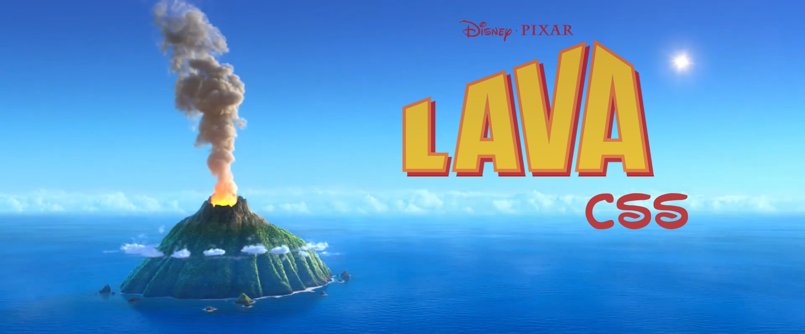

## Overview
This is an ongoing project to learn how to build a CSS framework from scratch.

### Goals

- Use latest CSS features tools, and libraries.
- Framework is not very opinionated, easily customisable and modules can be replaced easily without hassle.
- Small file size.
- CSS only.
- Default theme is Lava, because lava is cool... *please laugh* :sweat_smile:.
- Learn!

### What it's not

- Industry standard (support for older browsers is not considered).
- Heavyweight - not all components under the sun are included/implemented.

 

## Getting started

### Setup

1. Clone repository.
2. In the root directory run `npm install`.
3. Inspect the `package.json` for the list of available npm commands. (This project uses npm scripts, so don't worry about grunt or gulp!).

### Important commands

- `npm start` - starts dev server, watches src and docs.
- `npm run build` - builds all the things ready for production.

 

## Technology

- [Stylus](http://stylus-lang.com/) - this is what the cool kids use.
- [Pug](https://pugjs.org/) - R.I.P Jade.
- [Browsersync](https://browsersync.io/) - makes life so much easier!

## Contributors

- Sam Wemyss
